# English Transcript Preference Feature Design

## Overview

This design document outlines the implementation of English transcript preference functionality for the Repurpose API. The feature ensures that content generation always uses English transcripts by implementing a priority-based transcript selection system that prefers manual English transcripts, falls back to auto-generated English, and translates non-English transcripts when necessary.

## Architecture

### Current System Analysis

The existing system uses `youtube-transcript-api` v1.2.2 with basic transcript fetching in `core/services/transcript_service.py`. The current implementation:
- Fetches any available transcript without language preference
- Does not prioritize manual vs auto-generated transcripts
- Has no translation capability for non-English content

### Enhanced Architecture


## Enhanced Transcript Service Implementation

### Core Service Enhancement

```python
# Enhanced transcript_service.py structure
class TranscriptPriority(Enum):
    MANUAL_ENGLISH = 1
    AUTO_ENGLISH = 2  
    MANUAL_TRANSLATED = 3
    AUTO_TRANSLATED = 4

class EnglishTranscriptResult(BaseModel):
    transcript_text: str
    language_code: str
    is_generated: bool
    is_translated: bool
    priority: TranscriptPriority
    translation_source_language: Optional[str] = None

def get_english_transcript(video_id: str) -> Optional[EnglishTranscriptResult]
def list_available_transcripts_with_metadata(video_id: str) -> List[TranscriptMetadata]
def find_best_english_transcript_source(transcript_list) -> Optional[Transcript]
def translate_transcript_to_english(transcript, source_language: str) -> str
```

### Transcript Selection Logic

| Priority | Type | Language | Action | Fallback |
|----------|------|----------|---------|-----------|
| 1 | Manual | English | Use directly | → Priority 2 |
| 2 | Auto-generated | English | Use directly | → Priority 3 |
| 3 | Manual | Non-English | Translate to English | → Priority 4 |
| 4 | Auto-generated | Non-English | Translate to English | → Error |

### API Enhancement

#### Enhanced Transcript Response Model

```python
class EnhancedTranscriptResponse(BaseModel):
    youtube_video_id: str
    title: Optional[str] = None
    transcript: str
    transcript_metadata: EnglishTranscriptResult
    available_languages: List[str]
    status: Optional[str] = None
```

#### Configuration Options

```python
class TranscriptPreferences(BaseModel):
    prefer_manual: bool = True
    require_english: bool = True
    enable_translation: bool = True
    fallback_languages: List[str] = ["en", "es", "fr", "de"]
```

## Frontend Architecture Updates

### Enhanced API Client

```typescript
// Enhanced API types
interface TranscriptMetadata {
  language_code: string;
  is_generated: boolean;
  is_translated: boolean;
  priority: 'manual_english' | 'auto_english' | 'manual_translated' | 'auto_translated';
  translation_source_language?: string;
}

interface EnhancedTranscriptResponse {
  youtube_video_id: string;
  title?: string;
  transcript: string;
  transcript_metadata: TranscriptMetadata;
  available_languages: string[];
  status?: string;
}

// Enhanced transcription function
async function transcribeVideoWithPreferences(
  videoId: string,
  preferences?: TranscriptPreferences
): Promise<EnhancedTranscriptResponse>
```

### UI Components Enhancement

#### Transcript Status Indicator

```mermaid
graph LR
    A[Transcript Status Badge] --> B{Type Check}
    B -->|Manual English| C[🟢 Original English]
    B -->|Auto English| D[🟡 Auto-Generated English]  
    B -->|Translated Manual| E[🟠 Translated from X]
    B -->|Translated Auto| F[🔴 Auto-Translated from X]
```



#### Processing Progress Updates

```typescript
const getTranscriptProgressMessage = (status: string) => {
  const messages = {
    'checking_transcripts': 'Checking available transcripts...',
    'found_manual_english': 'Found manual English transcript ✓',
    'found_auto_english': 'Using auto-generated English transcript',
    'translating_manual': 'Translating manual transcript to English...',
    'translating_auto': 'Translating auto-generated transcript...',
    'transcript_ready': 'English transcript ready for processing'
  };
  return messages[status] || status;
};
```

## Data Flow Between Frontend and Backend

### Enhanced Video Processing Flow


### Streaming Updates Enhancement

```typescript
// Enhanced streaming response format
interface StreamingTranscriptUpdate {
  status: 'checking_transcripts' | 'found_manual_english' | 'translating_manual' | 'transcript_ready';
  message: string;
  progress: number;
  transcript_metadata?: {
    source_type: 'manual' | 'auto_generated';
    language: string;
    requires_translation: boolean;
    translation_confidence?: number;
  };
}
```

## Backend API Endpoints Enhancement

### Enhanced Transcription Endpoint

```python
@app.post("/transcribe/", response_model=EnhancedTranscriptResponse)
async def transcribe_video_enhanced(
    request: TranscribeRequest,
    preferences: Optional[TranscriptPreferences] = None,
    db: Session = Depends(get_db)
) -> EnhancedTranscriptResponse
```

### New Transcript Analysis Endpoint

```python
@app.get("/analyze-transcripts/{video_id}")
async def analyze_available_transcripts(
    video_id: str
) -> Dict[str, Any]:
    """
    Returns detailed analysis of available transcripts for a video
    including languages, types, and recommended processing approach
    """
```

### Enhanced Streaming Endpoint

```python
@app.post("/process-video-stream/")
async def process_video_with_enhanced_streaming(
    request: ProcessVideoRequest,
    db: Session = Depends(get_db)
) -> StreamingResponse:
    """Enhanced streaming with detailed transcript processing updates"""
```

## Error Handling Strategy

### Transcript Availability Scenarios

| Scenario | Response Strategy | User Feedback |
|----------|-------------------|---------------|
| No transcripts available | Return structured error | "No transcripts found for this video" |
| Translation service failure | Fallback to original language | "Using original language transcript" |
| Partial transcript data | Process available segments | "Partial transcript processed" |
| Rate limiting on translation | Queue for retry | "Translation queued for processing" |

### Error Response Enhancement

```python
class TranscriptError(BaseModel):
    error_code: str
    message: str
    available_languages: List[str]
    suggested_action: str
    fallback_available: bool

class EnhancedErrorResponse(BaseModel):
    success: bool
    error: Optional[TranscriptError] = None
    partial_data: Optional[Dict[str, Any]] = None
```

## Performance Optimization

### Caching Strategy


### Database Schema Enhancement

```sql
-- Enhanced video table structure
ALTER TABLE videos ADD COLUMN transcript_language VARCHAR(10);
ALTER TABLE videos ADD COLUMN transcript_type VARCHAR(20); -- 'manual' or 'auto_generated'
ALTER TABLE videos ADD COLUMN is_translated BOOLEAN DEFAULT FALSE;
ALTER TABLE videos ADD COLUMN source_language VARCHAR(10);
ALTER TABLE videos ADD COLUMN translation_confidence FLOAT;

-- New transcript cache table
CREATE TABLE transcript_cache (
    id INTEGER PRIMARY KEY,
    video_id VARCHAR(50) NOT NULL,
    language_code VARCHAR(10) NOT NULL,
    transcript_type VARCHAR(20) NOT NULL,
    transcript_text TEXT NOT NULL,
    is_translated BOOLEAN DEFAULT FALSE,
    source_language VARCHAR(10),
    cached_at TIMESTAMP DEFAULT CURRENT_TIMESTAMP,
    UNIQUE(video_id, language_code, transcript_type)
);
```

## Testing Strategy

### Unit Tests for Enhanced Transcript Service

```python
# Test cases for English transcript preference
class TestEnglishTranscriptPreference:
    def test_manual_english_priority(self)
    def test_auto_generated_english_fallback(self)
    def test_translation_from_manual_source(self)
    def test_translation_from_auto_source(self)
    def test_no_transcripts_available_error(self)
    def test_translation_service_failure_handling(self)
    def test_caching_behavior(self)
```

### Integration Tests

```python
# End-to-end testing scenarios
class TestVideoProcessingWithEnglishPreference:
    def test_video_with_manual_english_transcript(self)
    def test_video_with_only_auto_english(self)
    def test_video_requiring_translation(self)
    def test_streaming_response_with_transcript_updates(self)
    def test_error_handling_for_unavailable_transcripts(self)
```

### Frontend Component Tests

```typescript
// React component tests for enhanced UI
describe('Enhanced Transcript Processing', () => {
  test('displays correct transcript status badge');
  test('shows translation progress updates');
  test('handles transcript preference selection');
  test('displays error states appropriately');
});
```

## Implementation Phases

### Phase 1: Core Enhancement (Week 1)
- Enhance `transcript_service.py` with English preference logic
- Add transcript metadata models and response types
- Implement basic translation functionality
- Update database schema for transcript metadata

### Phase 2: API Integration (Week 2)  
- Update FastAPI endpoints with enhanced transcript handling
- Implement streaming updates for transcript processing
- Add comprehensive error handling and logging
- Create transcript analysis endpoint

### Phase 3: Frontend Updates (Week 3)
- Update TypeScript interfaces and API client
- Enhance UI components with transcript status indicators
- Add transcript preference configuration options
- Update progress messaging and error displays

### Phase 4: Optimization & Testing (Week 4)
- Implement caching strategy for translated transcripts
- Add comprehensive test coverage
- Performance optimization and monitoring
- Documentation updates and deployment preparation