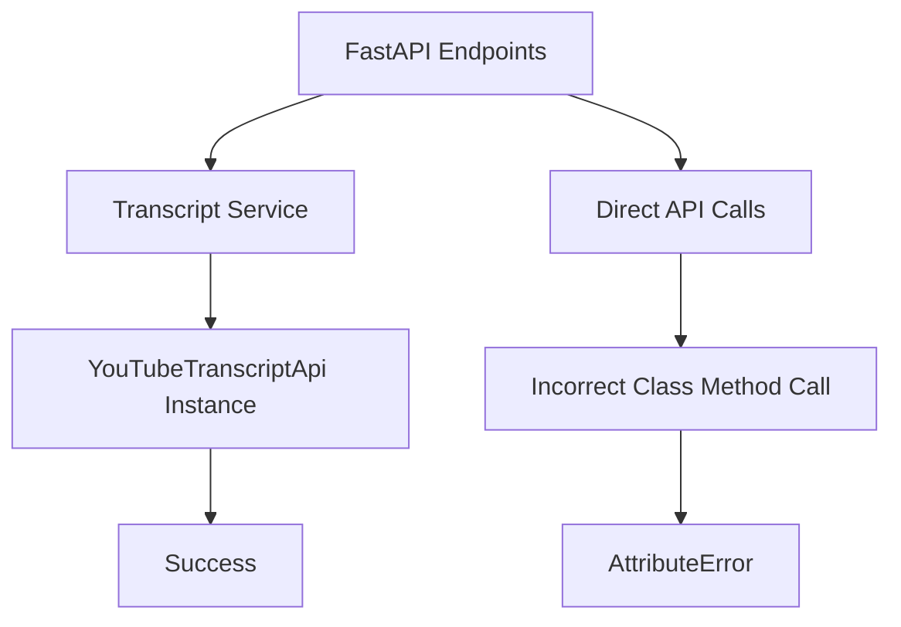
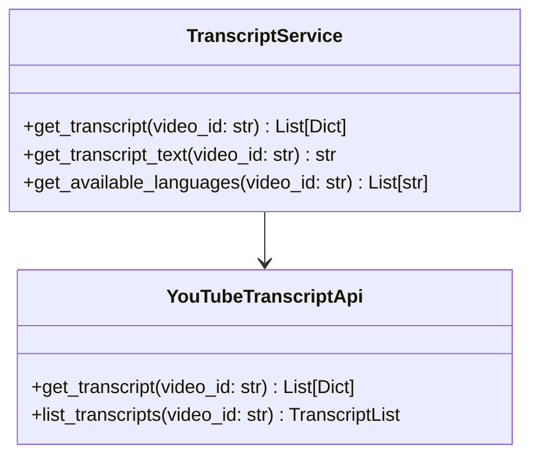
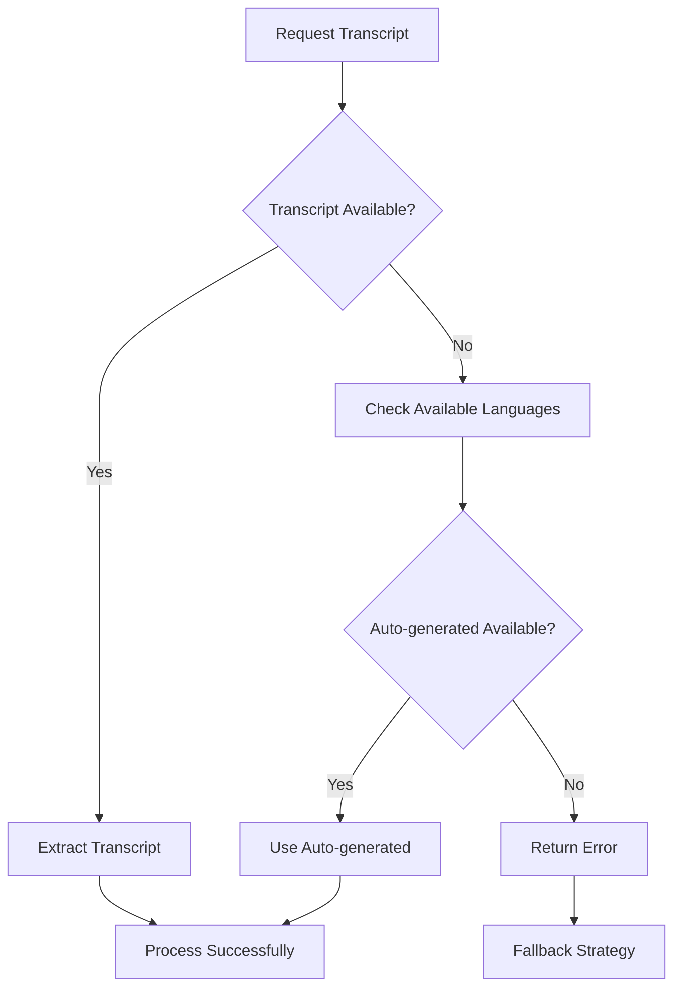
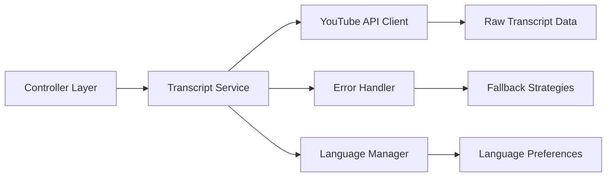
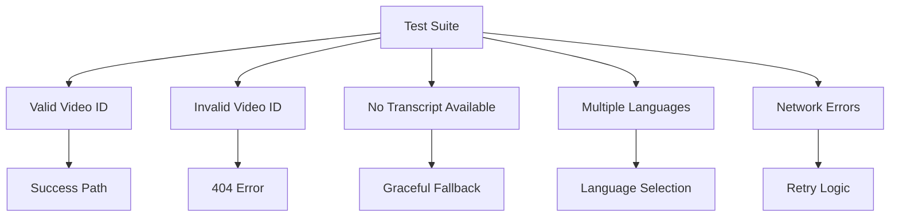

# YouTube Transcript API Integration Fix

## Overview

The application is experiencing a critical failure in the YouTube transcript extraction functionality. The error "type object 'YouTubeTranscriptApi' has no attribute 'get_transcript'" occurs because the code incorrectly attempts to call `get_transcript()` as a class method when it should use the proper YouTube Transcript API methods.

## Architecture

### Current Implementation Issues

The codebase has inconsistent usage of the YouTube Transcript API across different modules:

1. **Correct Implementation** (transcript_service.py):
   - Creates instance: `ytt_api = YouTubeTranscriptApi()`
   - Uses `fetch()` method: `transcript = ytt_api.fetch(video_id)`

2. **Incorrect Implementation** (main.py):
   - Calls non-existent class method: `YouTubeTranscriptApi.get_transcript()`

### Module Architecture



## API Integration Strategy

### YouTube Transcript API Methods

The `youtube-transcript-api` library provides the following correct usage patterns:

1. **Static Method Approach** (Recommended):
   ```python
   transcript_list = YouTubeTranscriptApi.get_transcript(video_id)
   ```

2. **Instance Method Approach** (Alternative):
   ```python
   api = YouTubeTranscriptApi()
   transcript = api.fetch(video_id)
   raw_data = transcript.to_raw_data()
   ```

### Standardized Service Interface



## Error Handling Architecture

### Transcript Availability Scenarios



### Error Recovery Patterns

1. **Language Fallback**: Try multiple language codes
2. **Auto-generated Fallback**: Use auto-generated if manual unavailable
3. **Graceful Degradation**: Continue processing without transcript

## Implementation Fixes

### Core Service Standardization

Update all transcript extraction calls to use the correct API:

```python
# Replace incorrect usage
transcript_list = YouTubeTranscriptApi.get_transcript(video_id)

# With correct usage
from youtube_transcript_api import YouTubeTranscriptApi

def get_transcript_safely(video_id: str) -> Optional[List[Dict[str, Any]]]:
    try:
        transcript_list = YouTubeTranscriptApi.get_transcript(video_id)
        return transcript_list
    except Exception as e:
        logging.error(f"Transcript extraction failed for {video_id}: {e}")
        return None
```

### Endpoint Integration Points

1. **Streaming Video Processor** (`/process-video-stream/`):
   - Line 292 in main.py needs correction
   - Add proper error handling and progress updates

2. **Standard Video Processor** (`/process-video/`):
   - Multiple instances need correction (lines 502, 540, 603, 625)
   - Ensure consistent error handling

3. **Transcript Endpoint** (`/transcribe/`):
   - Line 502 needs correction
   - Maintain existing response format

### Service Layer Enhancement



## Testing Strategy

### Unit Testing

1. **API Integration Tests**: Verify correct API method calls
2. **Error Handling Tests**: Test various failure scenarios
3. **Language Fallback Tests**: Verify language selection logic

### Integration Testing

1. **End-to-End Workflow**: Complete video processing pipeline
2. **Error Recovery**: Transcript failure scenarios
3. **Performance Testing**: Large transcript handling

### Test Scenarios

