# Content Editing Flow

## Detailed Content Editing Architecture & User Flow

---

## High-Level Editing Flow

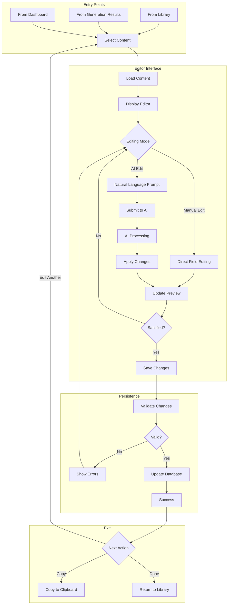

---

## AI Edit Flow Sequence

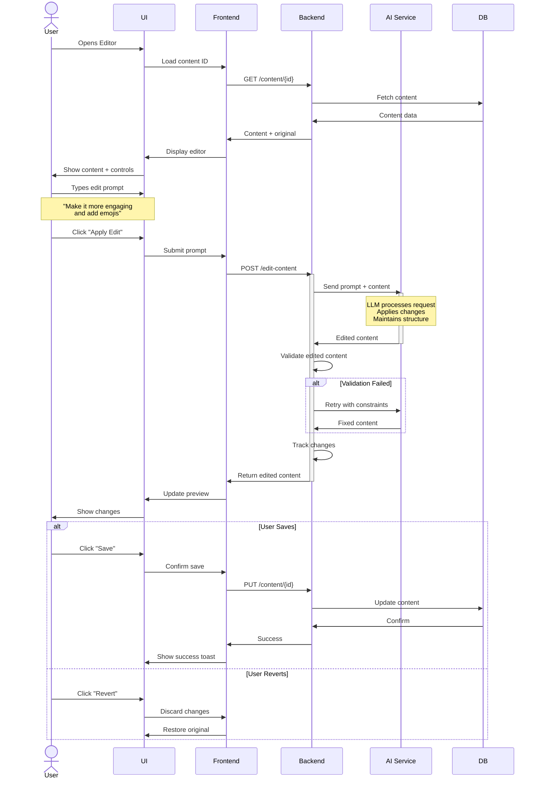

---

## Manual Edit Flow

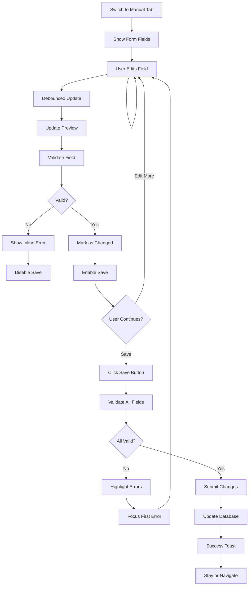

---

## State Management

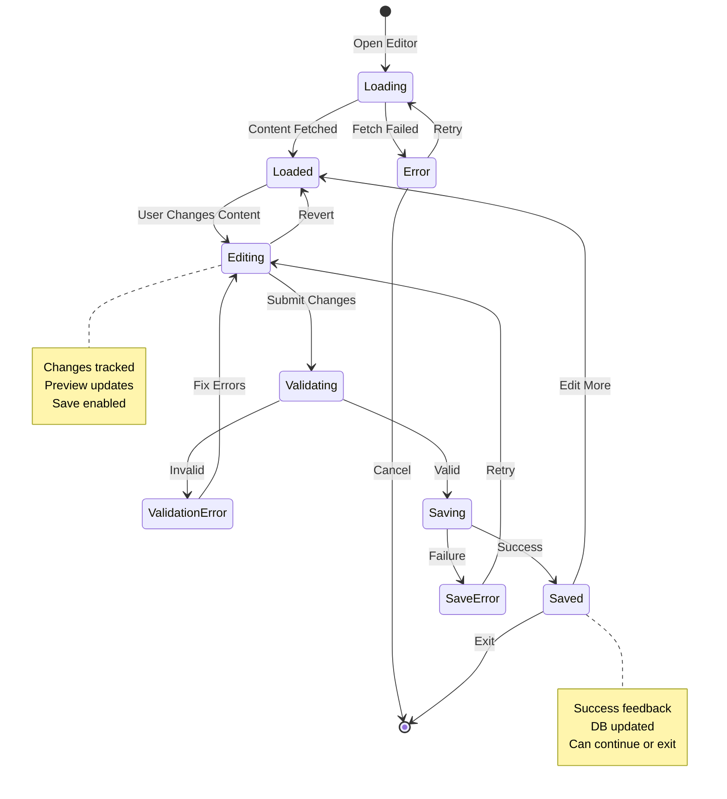

---

## Real-time Preview Updates

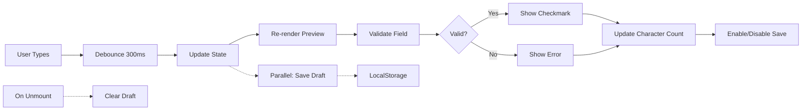

---

## Quick Edit Presets Flow

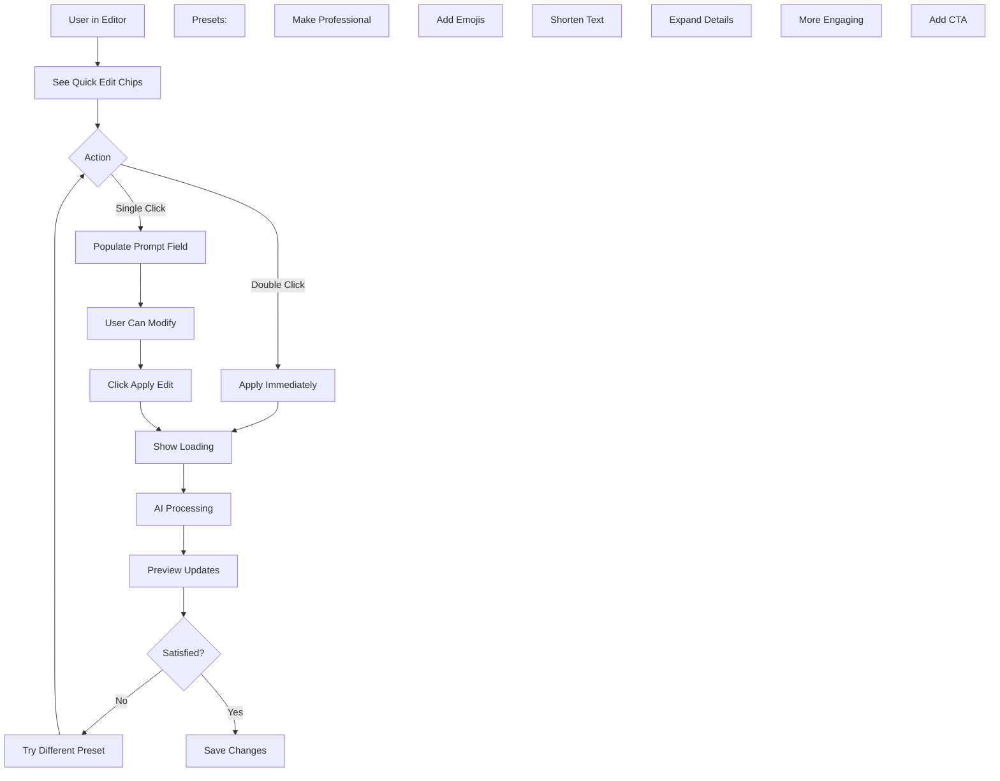

---

## Edit History Management

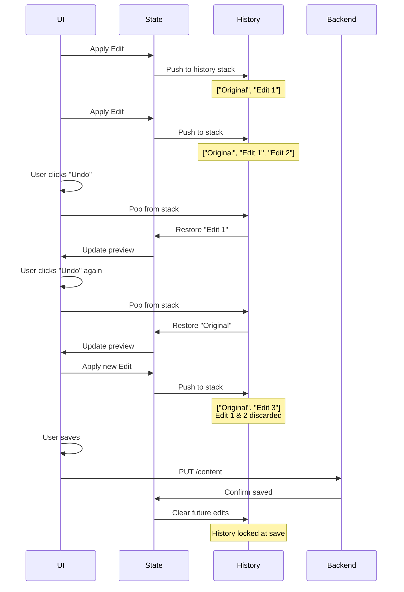

---

## Comparison Mode Flow

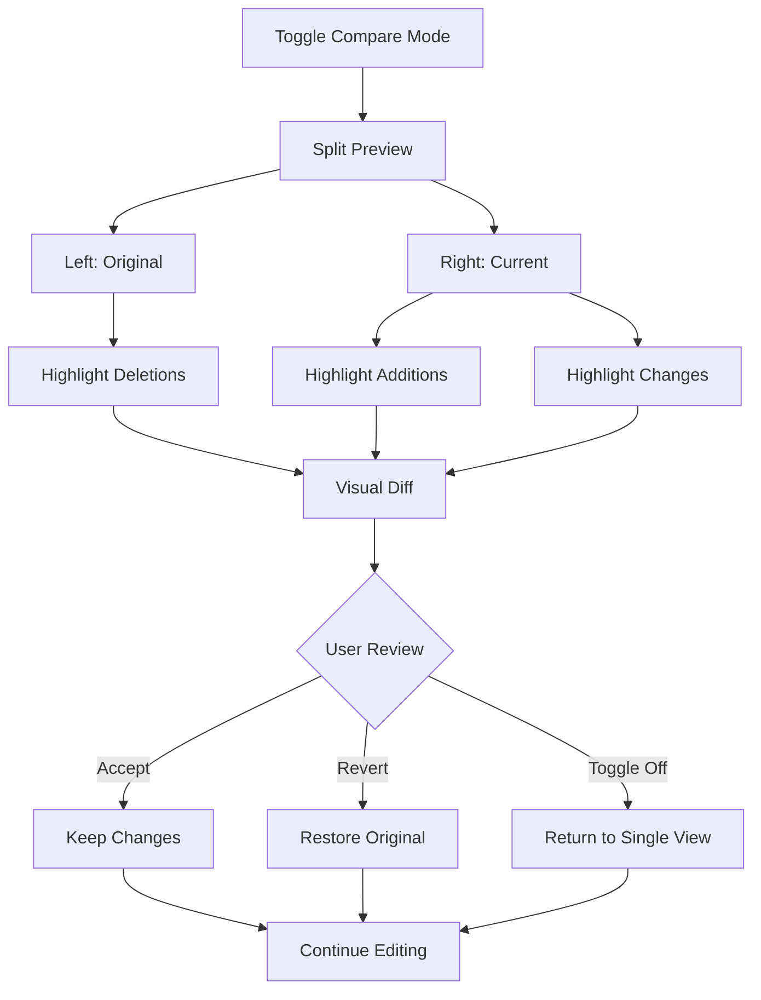

---

## Validation Flow Details

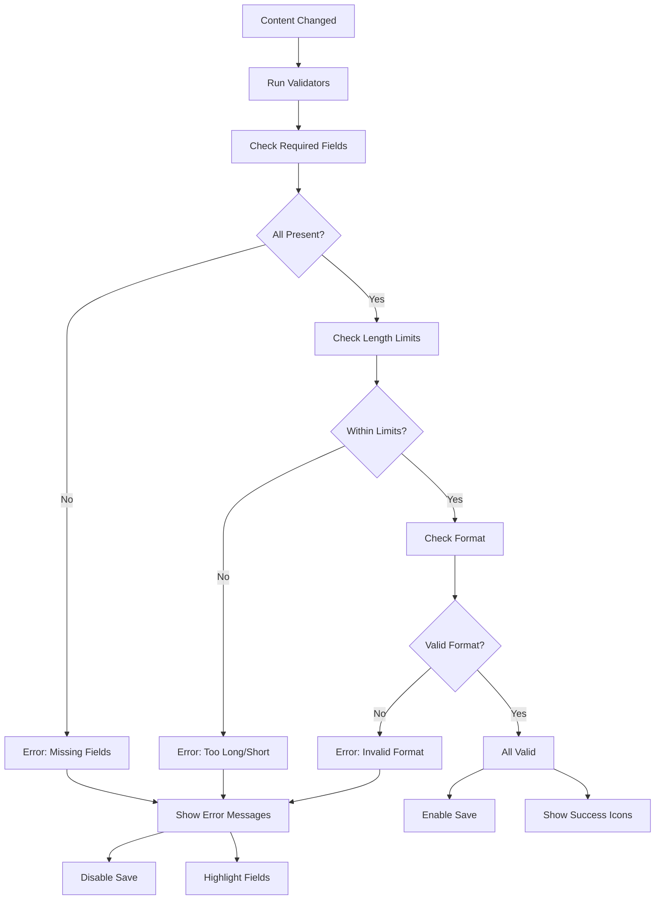

---

## Carousel Slide Editing Flow

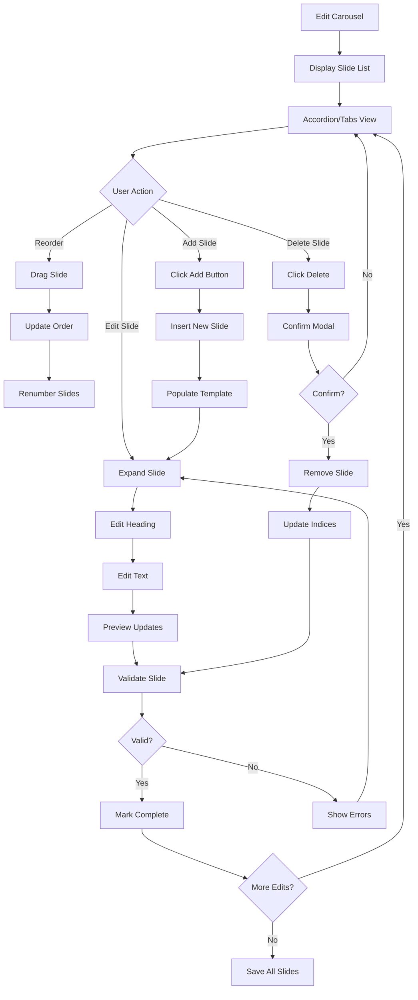

---

## Auto-save & Draft Management

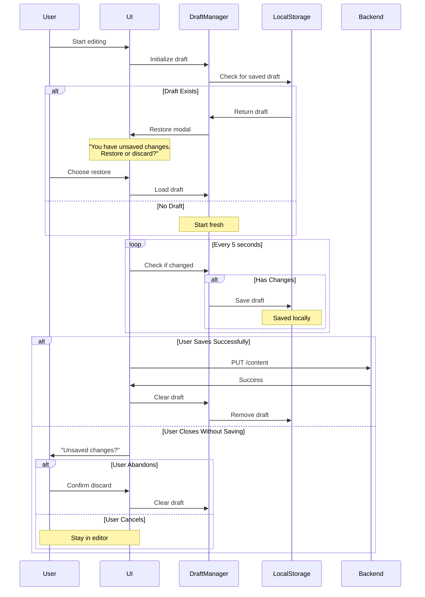

---

## Error Recovery in Editing

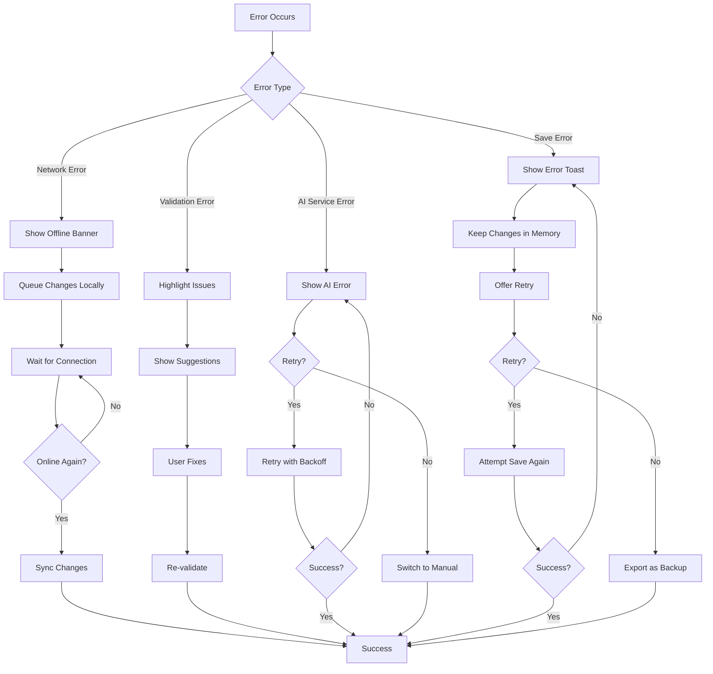

---

## Performance Optimizations

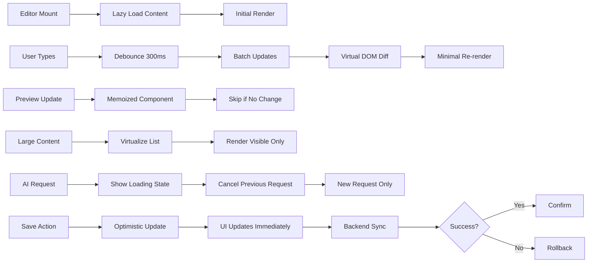

---

## Keyboard Shortcuts

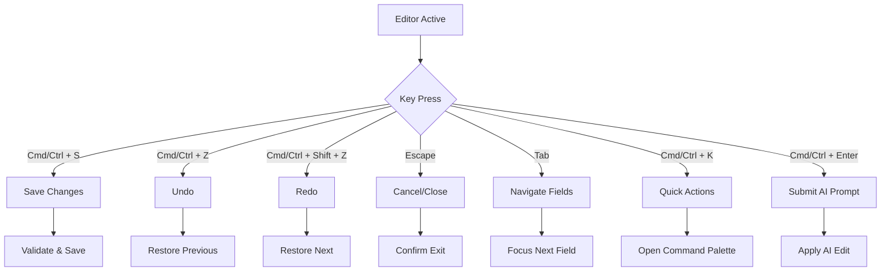

---

## API Endpoints for Editing

```
GET /content/{content_id}
  Response: {
    content_piece: ContentPiece
    original_content: ContentPiece
    video_info: VideoInfo
  }

POST /edit-content/
  Body: {
    video_id: string
    content_piece_id: string
    edit_prompt: string
    content_type: "reel" | "carousel" | "tweet"
  }
  Response: {
    edited_content: ContentPiece
    changes_made: string[]
    status: "success"
  }

PUT /content/{content_id}
  Body: {
    content_piece: ContentPiece (modified)
  }
  Response: {
    success: boolean
    content_piece: ContentPiece (saved)
  }

GET /content/{content_id}/history
  Response: {
    edits: EditHistory[]
  }

POST /content/{content_id}/revert
  Body: {
    to_version: number
  }
  Response: {
    reverted_content: ContentPiece
  }
```

---

## Best Practices for Editing UX

### Do's:
✓ Save drafts automatically
✓ Provide real-time preview
✓ Show character counts
✓ Validate incrementally
✓ Allow undo/redo
✓ Keep edit history
✓ Offer quick presets
✓ Support keyboard shortcuts

### Don'ts:
✗ Block UI during validation
✗ Lose unsaved changes
✗ Make save button hard to find
✗ Validate on every keystroke
✗ Hide errors cryptically
✗ Require confirmation for every action
✗ Disable features without explanation

---

## Testing Scenarios

1. **Edit → Save → Success**: Standard happy path
2. **Edit → Network Fail → Retry**: Error recovery
3. **Edit → Navigate Away → Warn**: Prevent data loss
4. **Multiple Edits → Undo/Redo**: History management
5. **AI Edit → Validation Fail → Auto-retry**: Smart recovery
6. **Long Content → Performance**: Optimization check
7. **Concurrent Edit → Conflict**: Handle race conditions
8. **Auto-save → Power Loss → Restore**: Draft recovery
