# User Journey Flowcharts

## Overview
Visual representations of key user journeys through the application using Mermaid diagrams.

---

## Journey 1: First-Time User - Single Video Processing

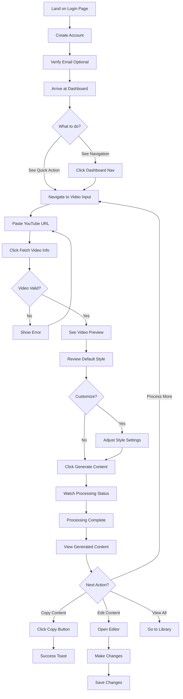

---

## Journey 2: Returning User - Quick Content Generation

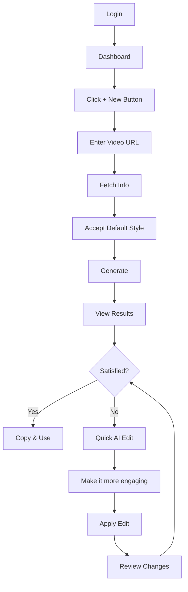

---

## Journey 3: Power User - Bulk Processing

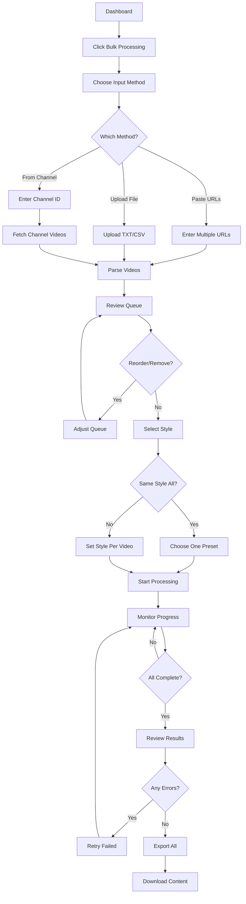

---

## Journey 4: Content Editor - Refining Content

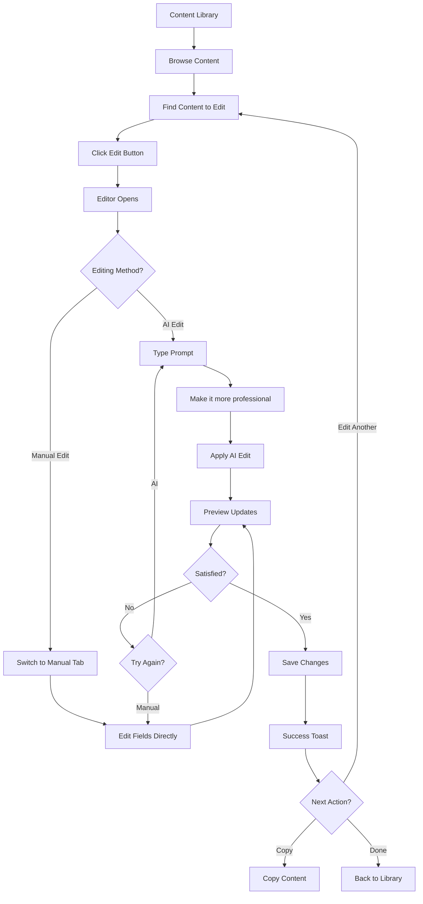

---

## Journey 5: Settings Configuration

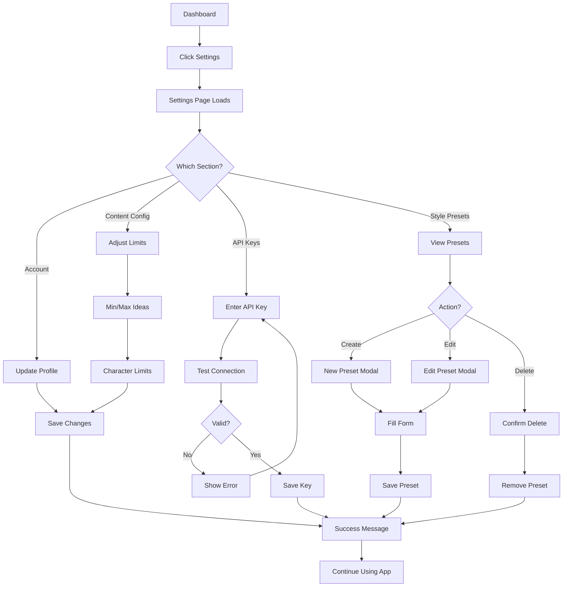

---

## Journey 6: Error Recovery

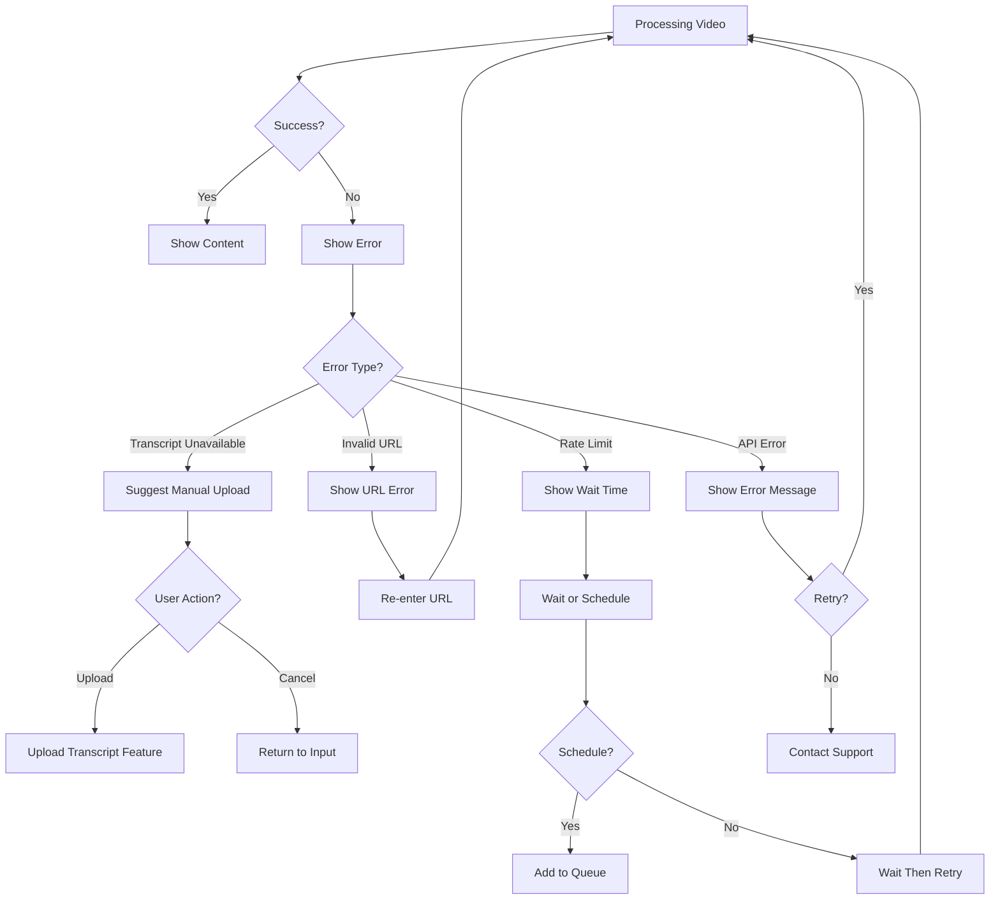

---

## Journey 7: Mobile User - Quick Copy Workflow

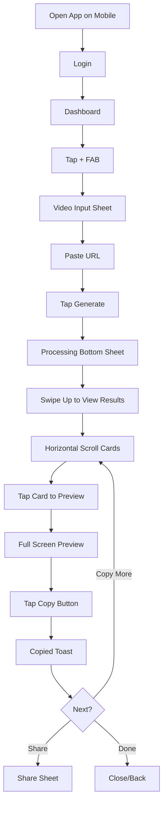

---

## Journey 8: Search & Filter in Library

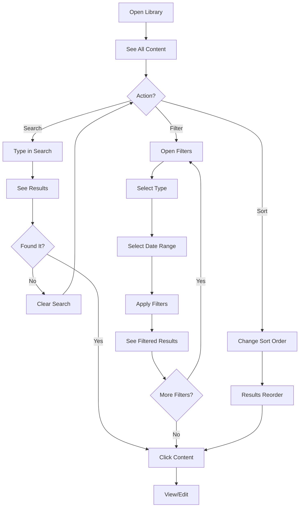

---

## Journey 9: Bulk Export Workflow

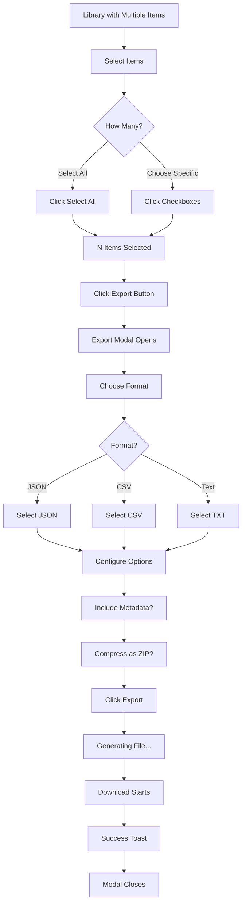

---

## Journey 10: Style Preset Management

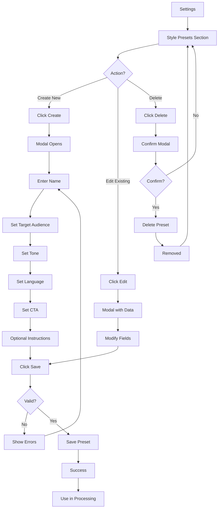

---

## Screen Transition Map

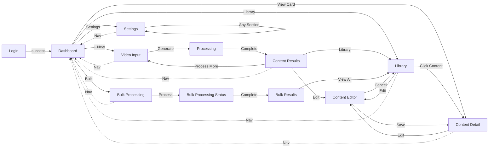

---

## State Transitions - Content Item

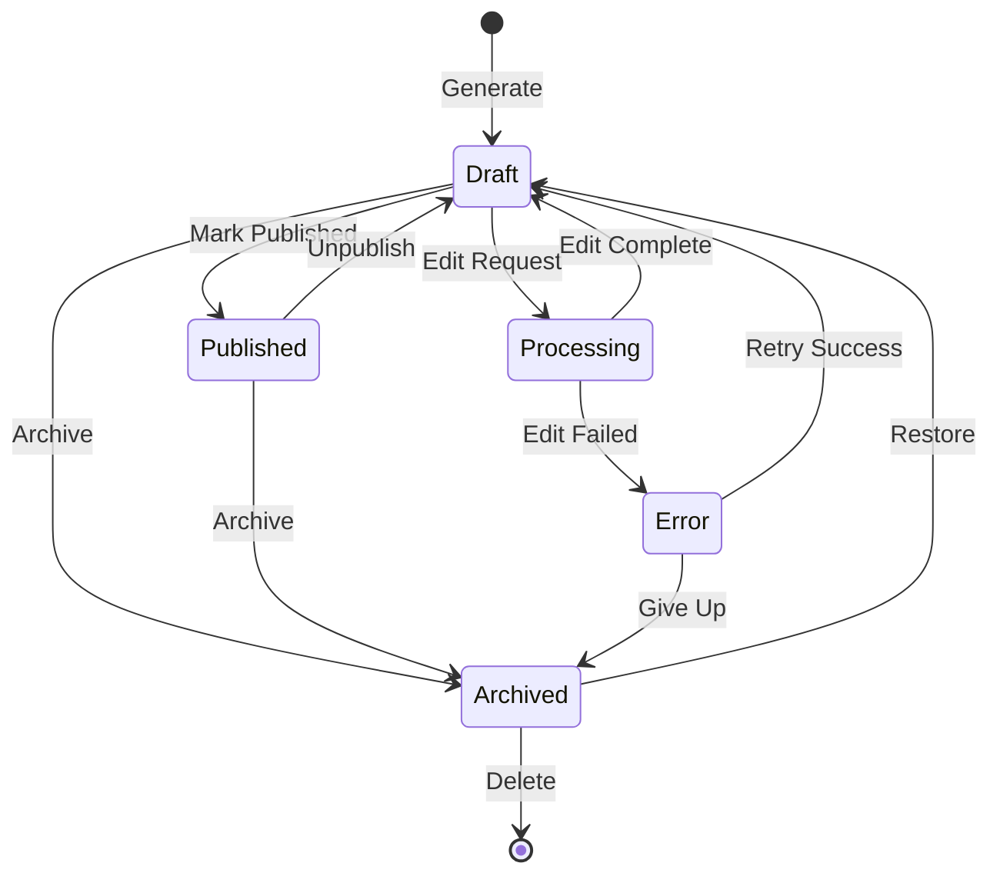

---

## Authentication Flow States

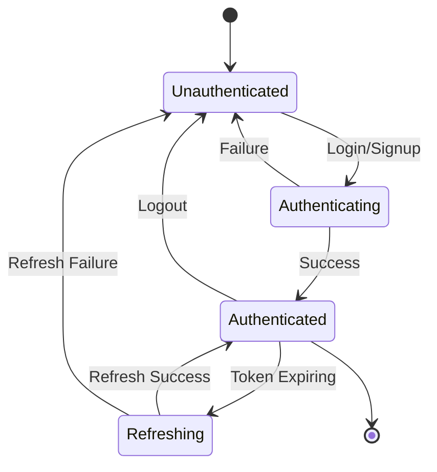

---

## Notes on Flow Design

### Design Principles Applied:
1. **Progressive Disclosure**: Complex options revealed only when needed
2. **Clear Feedback**: Every action has visible response
3. **Error Recovery**: Multiple paths to recover from errors
4. **Flexible Paths**: Users can achieve goals via different routes
5. **Non-Destructive**: Confirmations before destructive actions

### User Experience Highlights:
- Minimal steps to achieve primary goals
- Clear visual feedback at each step
- Multiple entry points to common tasks
- Easy error recovery
- Mobile-optimized flows
- Keyboard shortcuts for power users

### Flow Optimization:
- Reduced clicks for common tasks
- Smart defaults minimize decisions
- Batch operations for efficiency
- Background processing where possible
- Autosave prevents data loss
