# Video Processing Flow

## Detailed Video Processing Architecture & User Flow

---

## High-Level Processing Flow

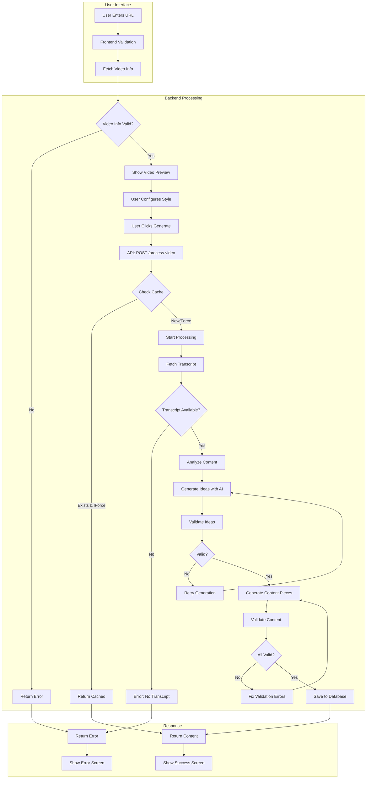

---

## Detailed Step-by-Step Flow

### Step 1: URL Input & Validation

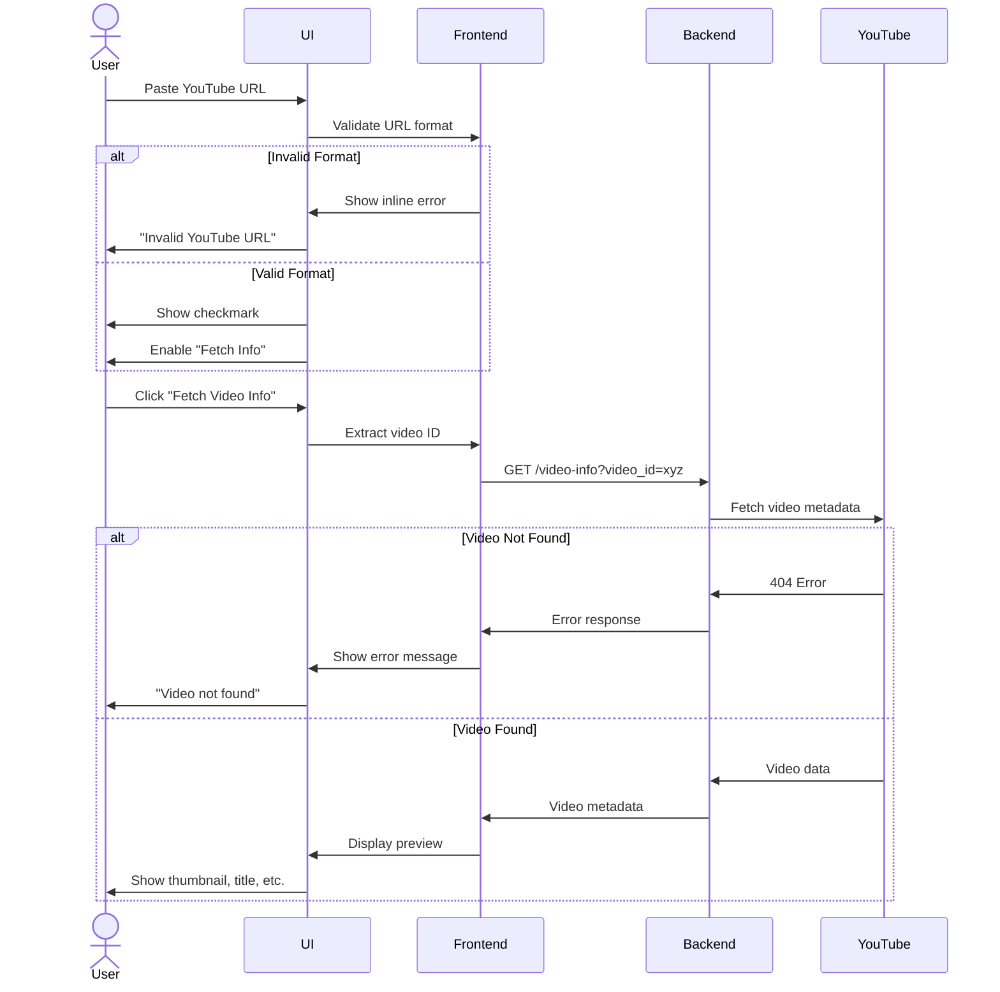

---

### Step 2: Style Selection & Configuration

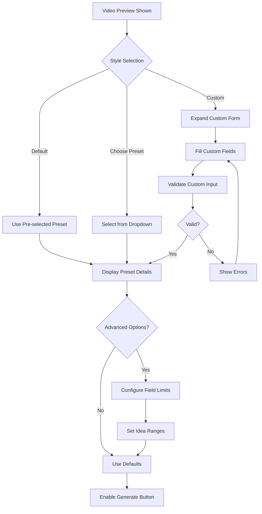

---

### Step 3: Content Generation Process

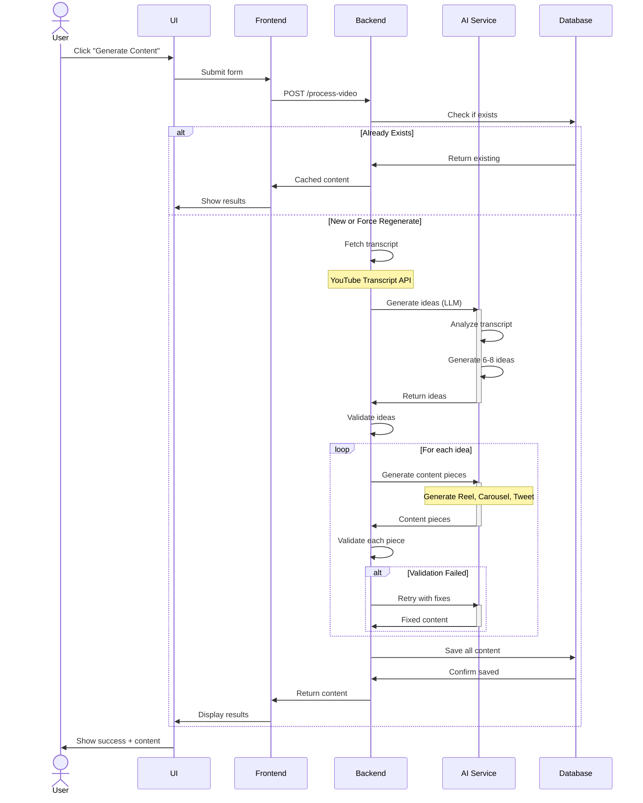

---

### Step 4: Real-time Progress Updates

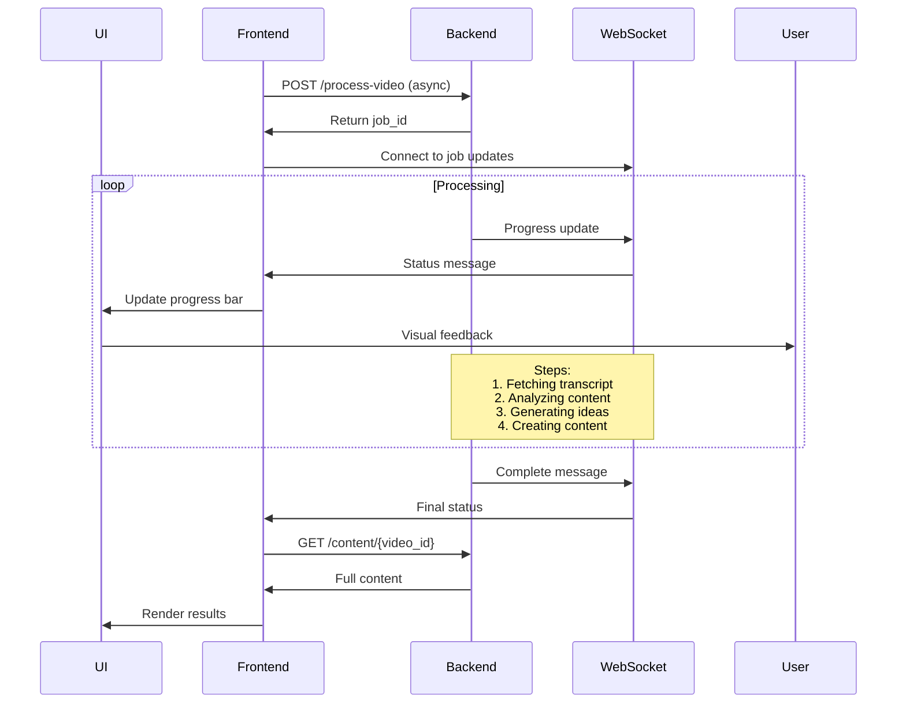

---

## State Machine: Processing States

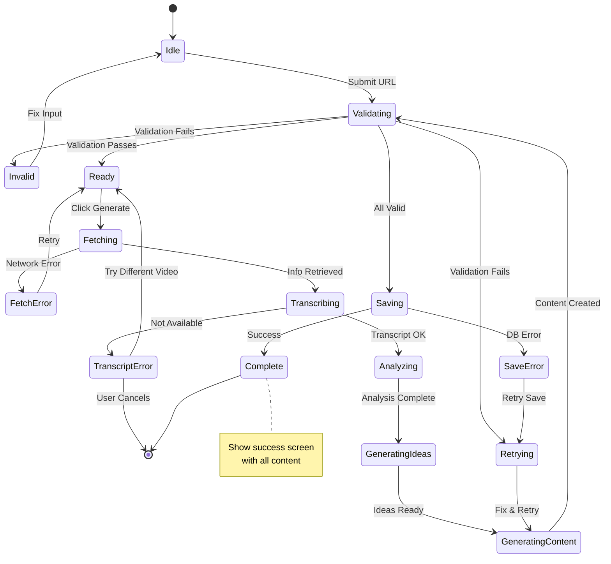

---

## Error Handling Flow

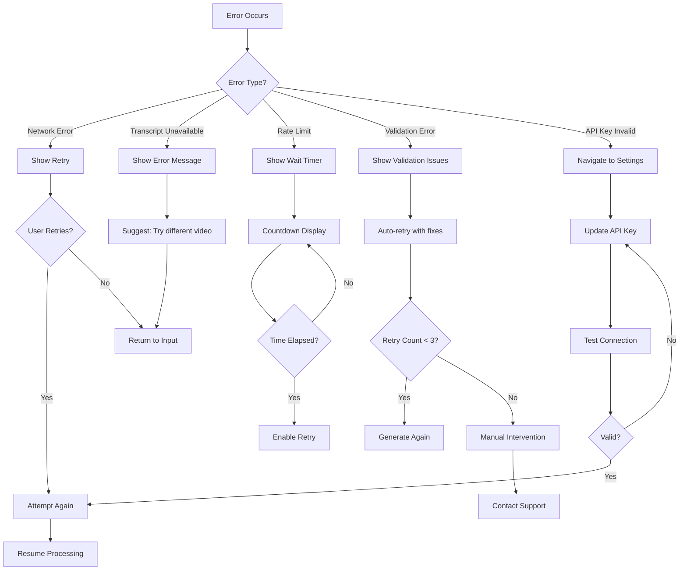

---

## Optimization: Caching Strategy

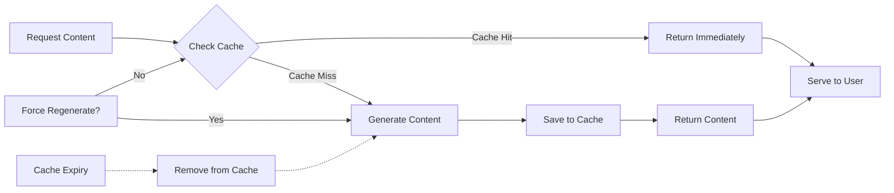

---

## Content Validation Flow

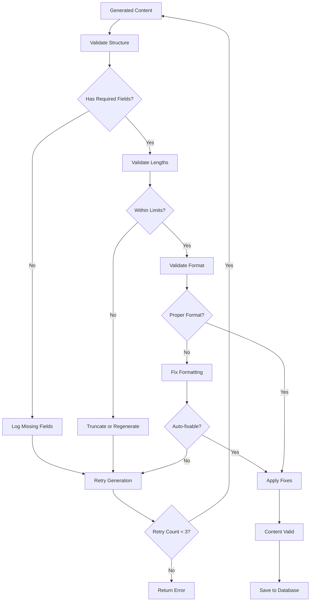

---

## Concurrent Processing (Bulk)

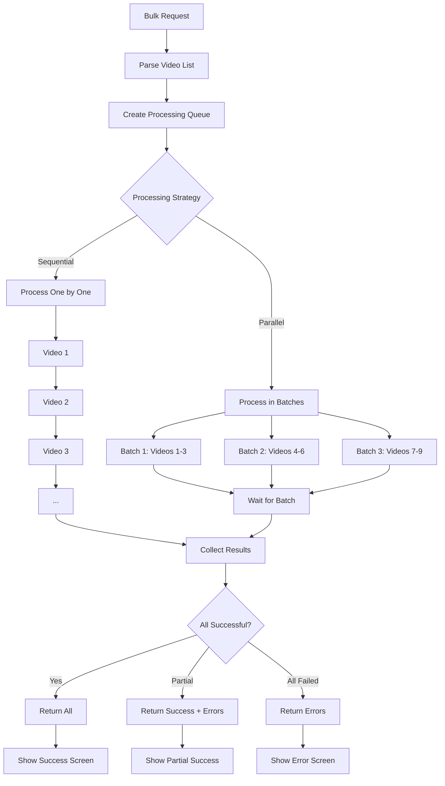

---

## Performance Monitoring

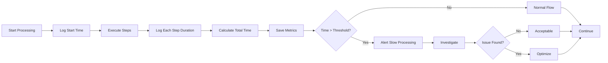

---

## Key Timing Expectations

| Step | Expected Duration | Timeout |
|------|------------------|---------|
| Fetch Video Info | 1-2s | 10s |
| Fetch Transcript | 2-5s | 15s |
| Generate Ideas (AI) | 10-20s | 60s |
| Generate Content (AI per piece) | 5-15s | 45s |
| Validate & Save | 1-2s | 10s |
| **Total** | **30-90s** | **180s** |

---

## API Endpoints Involved

```
GET  /video-info?video_id={id}
POST /process-video
  Body: {
    video_id: string
    style_preset?: string
    custom_style?: object
    force_regenerate?: boolean
  }
  
GET  /processing-status/{video_id}
  Response: {
    status: "queued" | "processing" | "complete" | "failed"
    progress: number (0-100)
    current_step: string
    estimated_time_remaining: number
  }
  
GET  /content/by-video/{video_id}
  Response: {
    content_pieces: ContentPiece[]
  }
  
POST /edit-content
  Body: {
    video_id: string
    content_piece_id: string
    edit_prompt: string
    content_type: string
  }
```

---

## Notes on Implementation

### Frontend Responsibilities:
- URL validation
- Form state management
- Progress tracking
- Error display
- Result rendering

### Backend Responsibilities:
- Video metadata fetching
- Transcript extraction
- AI content generation
- Validation & retry logic
- Database operations
- Caching

### Best Practices:
1. Always validate user input
2. Provide real-time feedback
3. Handle errors gracefully
4. Cache aggressively
5. Retry failed operations (with limits)
6. Monitor performance
7. Log everything for debugging
8. Use timeouts to prevent hangs
